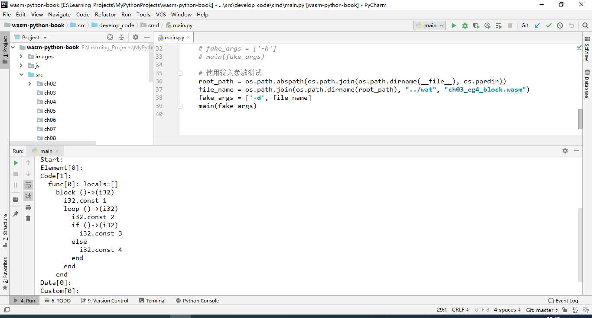
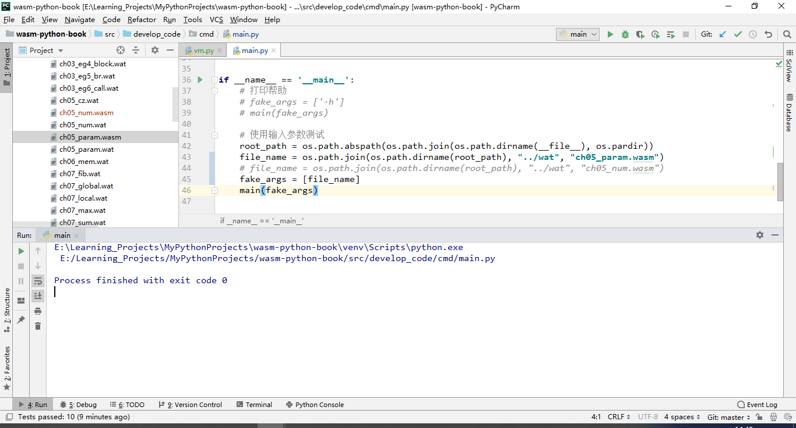

# WebAssembly的Python实现

项目完全参考张秀宏的《WebAssembly原理与核心技术》代码结构，在此向本书作者表示感谢。  
该书的随书代码github地址：https://github.com/zxh0/wasmgo-book  

## 运行环境
Python 版本：3.7.2  
PyCharm 版本：PyCharm 2018.3.7 (Professional Edition)  

## 代码结构
<pre>
images---------------------------------运行截图
js-------------------------------------对应第1、2章中的wasm文件
src------------------------------------WebAssembly代码
+-----ch02-----------------------------对应书中第2章实现代码
+-----ch03-----------------------------对应书中第3章实现代码
+-----ch05-----------------------------对应书中第5章实现代码
+-----ch06-----------------------------对应书中第6章实现代码
+-----ch07-----------------------------对应书中第7章实现代码
+-----ch08-----------------------------对应书中第8章实现代码
+-----ch09-----------------------------对应书中第9章实现代码
+-----ch10-----------------------------对应书中第10章实现代码
+-----ch11-----------------------------对应书中第11章实现代码
+-----ch12-----------------------------对应书中第12章实现代码
+-----ch13-----------------------------对应书中第13章实现代码
+-----develop_code---------------------持续开发的实现代码
      +-----binary---------------------指令解码
      +-----cmd------------------------主函数执行
      +-----interpreter----------------指令集
      +-----test-----------------------单元测试
wat------------------------------------测试的wat格式文件
</pre>

**注意：** 
1. 将src和develop_code设置成sources Root，可避免代码的引包报错。
2. 可通过使用wat2wasm指令将wat文件编译成wasm格式文件
```shell
wat2wasm xxx.wat
```

## 代码编写与运行结果
项目的所有运行都是采用直接运行cmd/main.py的方式，请读者运行时注意。

<details>
<summary>第2章-二进制格式</summary>
完成了模块解码器和dump程序。
传入参数：
> -d "wasm-python-book\js\ch01_hw.wasm"


1. 采用unittest进行单元测试
2. 由于使用小端格式读取数值，python可采用byteorder的little入参
    ```python
    int.from_bytes(self.data[:8], byteorder='little')
    ```
3. 如果该结构体是数组，由于Python无法表示结构数组，故类初始化的时候初始一个数组。
</details>

### 第3章-指令集
完成了指令的解码。



### 第5章-操作数栈
实现了操作栈和虚拟机框架，然后实现了参数和数值指令。


1. 针对大整数除法，python需要引入decimal包的Decimal类。
    ```python
    from decimal import Decimal
    v1 = Decimal(18446744073709551608)
    v2 = 2
    result = int(v1 / v2)
    assert result * v2 == v1
    ```
2. 由于python没有uint32和int32等类，故在interpreter/\_\_init\_\_.py代码中实现了相关的类（int8、int16、int32、int64、uint32、uint64、float32、float64）
3. 在操作数栈中，float32和float64存储的是编码之后的整数，pop均需要进行对应的解码：
    ```python
    def push_f32(self, val):
        val = struct.unpack('>l', struct.pack('>f', val))[0]
        self.push_u64(val)

    def pop_f32(self):
        val = self.pop_u64()
        val = struct.unpack('>f', struct.pack('>l', val))[0]
        return float32(val)
    ```

### 第6章-内存
### 第7章-函数调用（上）
### 第8章-控制指令
### 第9章-函数调用（下）
### 第10章-链接和实例化
### 第11章-错误处理和验证
### 第12章-编译为Wasm
### 第13章-AOT编译器

## 总结
