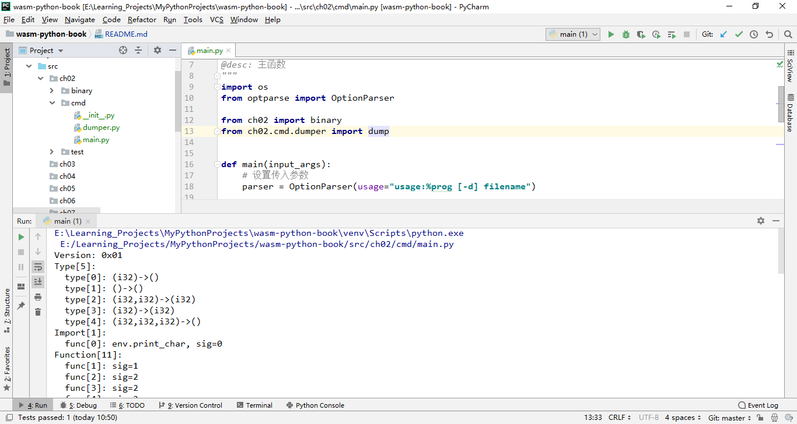
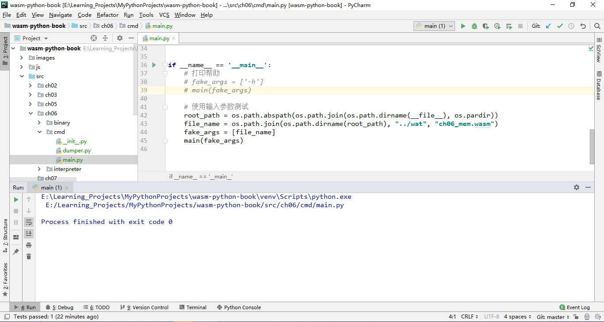
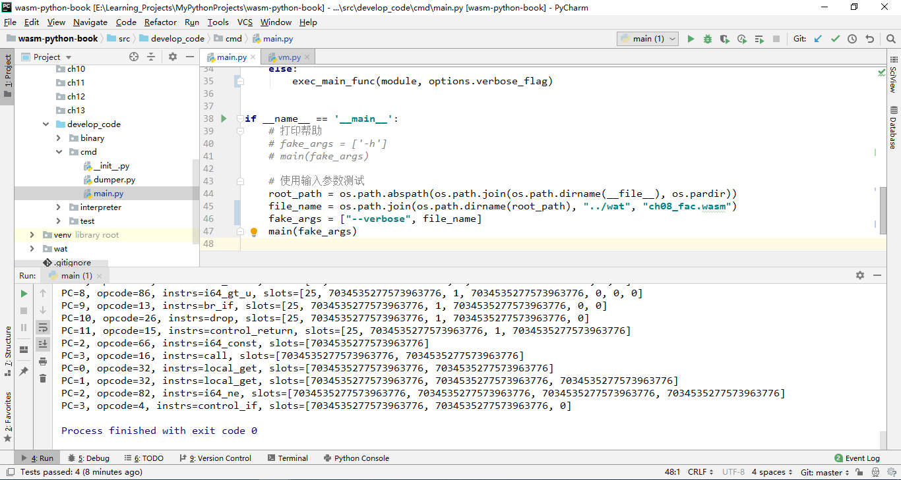
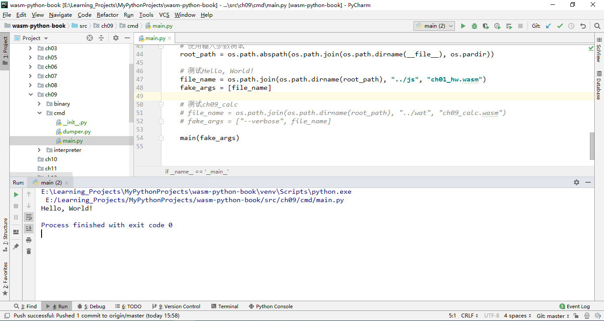
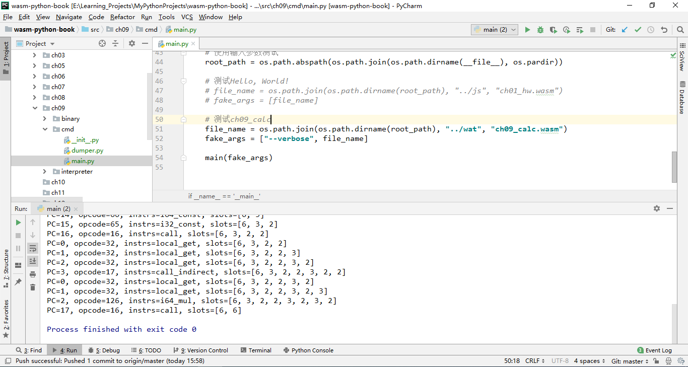
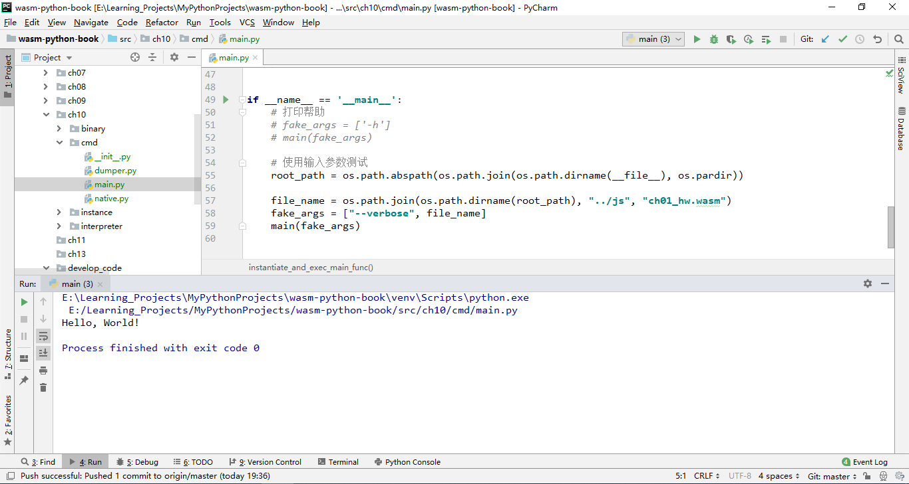
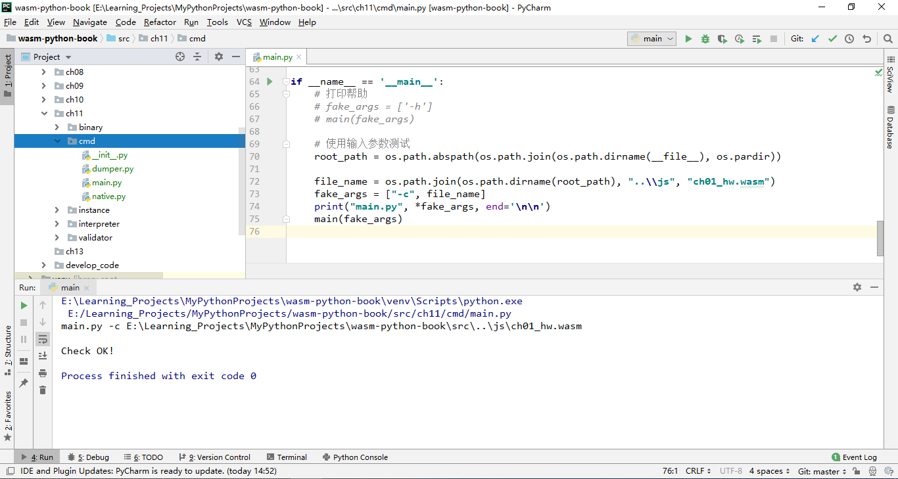

# WebAssembly解释器的Python实现

&emsp;&emsp;项目完全参考张秀宏的《WebAssembly原理与核心技术》代码结构，在此向本书作者表示感谢。  
&emsp;&emsp;该书的随书代码github地址：https://github.com/zxh0/wasmgo-book  

## 运行环境
Python 版本：3.7.2  
PyCharm 版本：PyCharm 2018.3.7 (Professional Edition)   
Wabt版本：wabt-1.0.19 

### 环境及工具下载地址
链接：https://pan.baidu.com/s/10R8n71TNTwBvkUZ9WLmCHg 
提取码：citl

## 代码结构
<pre>
images---------------------------------运行截图
js-------------------------------------对应第1、2章中的wasm文件
spec-----------------------------------spec test文件
src------------------------------------WebAssembly代码
+-----ch02-----------------------------对应书中第2章实现代码
+-----ch03-----------------------------对应书中第3章实现代码
+-----ch05-----------------------------对应书中第5章实现代码
+-----ch06-----------------------------对应书中第6章实现代码
+-----ch07-----------------------------对应书中第7章实现代码
+-----ch08-----------------------------对应书中第8章实现代码
+-----ch09-----------------------------对应书中第9章实现代码
+-----ch10-----------------------------对应书中第10章实现代码
+-----ch11-----------------------------对应书中第11章实现代码
+-----develop_code---------------------持续开发的实现代码
      +-----binary---------------------指令解码
      +-----cmd------------------------主函数执行
      +-----instance-------------------实例
      +-----interpreter----------------指令集
      +-----validator------------------模块验证
      +-----test-----------------------单元测试
wat------------------------------------测试的wat格式文件
</pre>

**注意：** 
1. 将src和develop_code设置成sources Root，可避免代码的引包报错。
2. 可通过使用wat2wasm指令将wat文件编译成wasm格式文件
```shell
wat2wasm xxx.wat
```

## 代码编写与运行结果
项目的所有运行都是采用直接运行cmd/main.py的方式，请读者运行时注意。

### 第2章-二进制格式

&emsp;&emsp;完成了模块解码器和dump程序。
传入参数：
```
-d "wasm-python-book\js\ch01_hw.wasm"
```


1. 采用unittest进行单元测试
2. 由于使用小端格式读取数值，python可采用byteorder的little入参
    ```python
    int.from_bytes(self.data[:8], byteorder='little')
    ```
3. 如果该结构体是数组，由于Python无法表示结构数组，故类初始化的时候初始一个数组。

### 第3章-指令集

&emsp;&emsp;完成了指令的解码。


### 第5章-操作数栈

&emsp;&emsp;实现了操作栈和虚拟机框架，然后实现了参数和数值指令。


1. 针对大整数除法，python需要引入decimal包的Decimal类。
    ```python
    from decimal import Decimal
    v1 = Decimal(18446744073709551608)
    v2 = 2
    result = int(v1 / v2)
    assert result * v2 == v1
    ```
2. 由于python没有uint32和int32等类，故在interpreter/\_\_init\_\_.py代码中实现了相关的类（int8、int16、int32、int64、uint32、uint64、float32、float64）
3. 在操作数栈中，float32和float64存储的是编码之后的整数，pop均需要进行对应的解码：
    ```python
    def push_f32(self, val):
        val = struct.unpack('>l', struct.pack('>f', val))[0]
        self.push_u64(val)

    def pop_f32(self):
        val = self.pop_u64()
        val = struct.unpack('>f', struct.pack('>l', val))[0]
        return float32(val)
    ```
    
### 第6章-内存

&emsp;&emsp;实现了Wasm内存和相关指令，Wasm内存是一块抽象的RAM（本质上就是个线性的字节数组），并且可以在限制范围内按页动态增长。Wasm提供了丰富的内存指令，用于读写各种基本类型的数值，这些数值在Wasm内存中按小端方式存储。简而言之，Wasm内存和真实内存非常接近，只具备最基本的读写能力，像内存管理、垃圾回收这些高级功能都要靠高级语言自己去解决。也正是因为贴近底层，Wasm程序才能够以接近本地程序的速度被执行。

  

### 第7章-函数调用（上）
&emsp;&emsp;实现了直接函数调用指令、局部变量和全局变量指令。


### 第8章-控制指令

&emsp;&emsp;传统的goto/jump指令被Wasm摒弃，取而代之的是结构化控制指令（block、loop、if）和受限的分支指令（br等）。


新增"--verbose"命令，调用如下：
```shell
--verbose "wasm-python-book\wat\ch08_fac.wasm"
```
### 第9章-函数调用（下）

&emsp;&emsp;设计了本地函数调用接口，并且实现了本地函数调用，然后实现了表和间接函数调用指令。
1. 执行HelloWorld程序，得到打印结果为"Hello, World!"


2. 执行ch09_calc程序，得到加法、减法和乘法的验证结果


### 第10章-链接和实例化

&emsp;&emsp;块从二进制格式到函数执行分为3个语义阶段：解码、验证、执行（实例化、函数调用）。模块可以导出或导入4种成员：函数、表、内存、全局变量，多个模块实例链接在一起，共享这4种成员，本章实现模块的链接和实例化。


### 第11章-错误处理和验证

&emsp;&emsp;Wasm采用类型安全的操作数栈以及结构化控制指令和受限的跳转指令，这使得函数的字节码很容易被验证，而且可以在线性时间内完成。


## 总结
&emsp;&emsp;历时7天（2020年08月18日——2020年8月24日）完成1-11章的代码，基本实现了一个Wasm解析器，提供如下命令：
> -v, --version : 版本号  
-d, --dump : 打印模块信息

&emsp;&emsp;由于之前有[JVMByPython](https://github.com/Relph1119/JVMByPython)项目的代码实现基础，目前已完成的功能有Wasm的二进制格式解码、指令集、操作数栈和虚拟机、内存及内存指令、函数调用（本地方法和外部方法调用）、实例化模块、模块错误处理和验证等。  
&emsp;&emsp;另：挺感谢作者在我实现代码期间给予的指导和帮助，目前该项目还需要完成spec的wast格式解析和测试、AOT和JIT的实现等。

## Spec Test
未测试通过的文件：
- br_table.wast：运行时间太长
